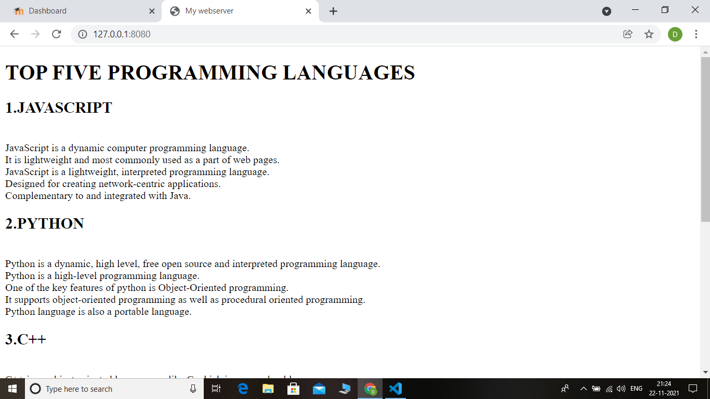
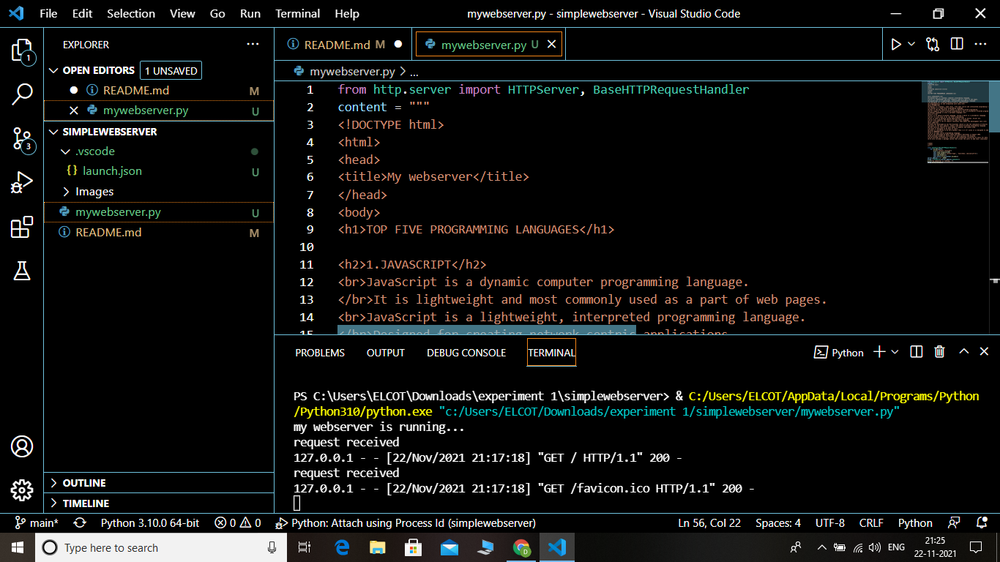

# Developing a Simple Webserver
## AIM:
To develop a simple webserver to display top five programming languages. 

## DESIGN STEPS
### Step 1: 
HTML content creation
### Step 2:
Design of webserver workflow
### Step 3:
Implementation using Python code
### Step 4:
Serving the HTML pages.
### Step 5:
Testing the webserver

## PROGRAM:
```
from http.server import HTTPServer, BaseHTTPRequestHandler
content = """
<!DOCTYPE html>
<html>
<head>
<title>My webserver</title>
</head>
<body>
<h1>TOP FIVE PROGRAMMING LANGUAGES</h1>

<h2>1.JAVASCRIPT</h2>
<br>JavaScript is a dynamic computer programming language.
</br>It is lightweight and most commonly used as a part of web pages.
<br>JavaScript is a lightweight, interpreted programming language.
</br>Designed for creating network-centric applications.
<br>Complementary to and integrated with Java.</br>
<h2>2.PYTHON</h2>
<br>Python is a dynamic, high level, free open source and interpreted programming language.
</br>Python is a high-level programming language.
<br>One of the key features of python is Object-Oriented programming.
</br>It supports object-oriented programming as well as procedural oriented programming.
<br>Python language is also a portable language.</br>
<h2>3.C++</h2>
<br>C++ is an object-oriented language, unlike C which is a procedural language.
</br>C++ is also used to do low level programming. 
<br>It is used to develop system applications such as kernel, driver etc. 
</br>It also supports the feature of high level language. 
<br>C++ provides a lot of inbuilt functions that makes the development fast.</br>
<h2>4.JAVA</h2>
<br>Java was developed by Sun Microsystems (which is now the subsidiary of Oracle) in the year 1995. 
</br>Java is the most popular, widely used object-oriented programming language. 
<br>The security feature of Java makes it popular and widely used. 
</br>Java is designed to be easy to learn.
<br>Java is considered to be more dynamic than C or C++ since it is designed to adapt to an evolving environment.</br> 
<h2>5.R LANGUAGE</h2>
<br>R is an open source programming language. 
</br>It was developed by Roass Ihaka and Robert Gentleman in August 1993.
<br>R provides graphical facilities for data analysis and display.
</br>R provides an extensive, coherent and integrated collection of tools for data analysis.
<br>R also includes a package system that allows the users to add their individual functionality in a manner that is indistinguishable from the core of R.</br>


</body>
</html>
"""
class myhandler(BaseHTTPRequestHandler):
    def do_GET(self):
        print("request received")
        self.send_response(200)
        self.send_header('content-type', 'text/html; charset=utf-8')
        self.end_headers()
        self.wfile.write(content.encode())
server_address = ('',8080)
httpd = HTTPServer(server_address,myhandler)
print("my webserver is running...")
httpd.serve_forever()
```

## OUTPUT:

## Client Side Output :


## Server Side Output :


## RESULT:

A simple webserver to display top five programming languages is developed
